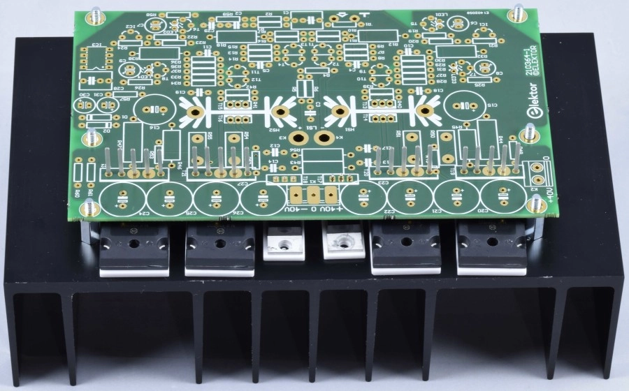

<h1 itemprop="headline" class="pt-5 mt-5 c-font-secondary c-font-bold c-margin-t-20 c-margin-b-20">Elektor "Fortissimo-100" Power Amplifier Kit</h1> 
by Ton Giesberts*: https://www.elektormagazine.com/labs/fortissimo-100   
you can buy the komplete Kit here from Elektor: https://www.elektor.com/elektor-fortissimo-100-power-amplifier-kit   
https://youtu.be/alOJrB1mdp8?t=882   
if you like a SMPS instead of a classical linear power supply, 
here is a recommendation: https://connexelectronic.com/product/smps800re/   
*(https://www.elektormagazine.com/authors/101/ton-giesberts)

<section class="Labs__container">
<article class="LabProject__description mb-20">

<strong>High-End, THD+N 0.0008 % at 50 W/8Ω, Max power (THD 1%) 98W/8Ω 188W/4Ω, Solid module, all THT components, ThermalTrak power transistors, fully symmetrical design</strong>
 

This amplifier is partially designed with amplifiers from the past in mind like the Medium Power AF amplifier from October 1990 (<a href="https://www.elektormagazine.com/magazine/elektor-199010/32233" title="https://www.elektormagazine.com/magazine/elektor-199010/32233">https://www.elektormagazine.com/magazine/elektor-199010/32233</a>). However, the output stage is of a different kind, it is still class-AB but has a symmetrical bootstrap configuration. Maximum output swing is higher without having to use higher power supply voltages for the voltage amplifier stages. This bootstrap works best using thermally matched bias diodes like inside ThermalTrak transistors from On Semiconductor, types NJL3281D (NPN) and NJL1302D (PNP). Maximum output voltage is almost 2 V higher this way compared to the classical design where the push-pull stage of the voltage amplifier stage sets the current of a bias transistor for temperature compensation of the variation of the base-emitter voltage of the transistors in the output stage. The power supply must have a regulated symmetrical +/- 40 V to ensure optimum performance. Maximum power (THD 1%) is close to 100 W in an 8 Ω load and 190 W in a 4 Ω load (see measurements). All parts are through hole making it easy to build the amplifier. The design is fully symmetrical. The six transistors in the output stage are placed halfway underneath the PCB and the main PCB is placed parallel to the heatsink, creating a solid module. 6 3 mm holes must be drilled to fit the power transistors and 6 3 mm holes for standoff’s to attach the PCB to the heatsink. Assuming the use of heatsink SK53-100-SA from Fischer Elektronik no M3 female thread needs to be cut by using M3 taps and handle. The 12 holes are placed between the fins and there’s even a little room for error. This mechanical work is probably the most challenging part building the amplifier. Of course pins of the transistors mounted on the large heatsink must be bend perpendicular and the correct position of those six holes must be assessed with some accuracy.   
Schematic:  

  
<h3>Differential amplifier stages</h3>
The design uses good old BC546B/BC556B transistors especially for the differential amplifiers (T1/T2, T3/T4, T9/T10, T11/T12). These types have a higher transition frequency than more modern types like KSC1845/KSA992. Always be careful in substituting the BC546B and BC556B with different types. The previous mentioned types not only have a different pinout but will affect stability. The use of other types will change the frequency compensation networks and possibly the layout also. Red rectangle shaped LED’s, placed against the transistor, are used as references for the current sources of&nbsp; the differential amplifiers. To limit power dissipation of the current source transistors T5,T6,T7 and T8 1 W resistors R12,R18,R32 and R38 are placed in series. To make the reference voltages as clean as possible two integrated current sources of type LM334 (IC1/IC2) set the current through the LED’s to 2 mA. One for each side of the symmetrical power supply. Since the maximum voltage of the LM334 is 40 V, the same as the power supply voltage of the amplifier, resistors R20 and R23 are placed in series to lower the voltage across IC1 and IC2, just to be safe. The current of the LM334’s is set by 33 Ω resistors R21 and R24. The gain of the amplifier is set by feedback resistors R4 and R5 making it about 26.6. Low-pass filter R2/R3/C2, to filter out frequencies at the input the amplifier can’t handle, lowers total gain to 25.6. Maximum input voltage needed for undistorted output swing is a little over 1 V. C3 and R6 in the feedback ensure HF stability. Frequency compensation RC-networks R9/C4 and R15/C5 in the first differential amplifiers (T1/T2, T3/T4) are necessary to make the feedback of the amplifier stable. The second differential amplifiers (T9/T10, T11/T12) provide a little extra gain but more important drive the next amplifier stage (push-pull) with a much lower impedance (R28 and R34). Networks R31/C10 and R37/C11 are lead compensations to improve HF characteristic of the amplifier. To make the collector-emitter voltage of both transistors in the second differential amplifier almost equal R27/R33 are added. The voltage difference between R27 and R28 (R33 and R34) must not exceed 0.35 V, preferably less (theoretically less than 0.1 V), or else the properties (VBE and hFE) of the transistors in the first differential amplifiers are not equal enough. When measuring you will notice a variation because the transistor pairs are not thermally coupled like a real dual transistor, in the same package on a same chip. The transistors in a KIT are not selected for these properties. Best would be to measure them first and select the most equal for the pairs. Selecting pairs using only a hFE measurement with for instance a multimeter is not enough. VBE at the same collector emitter voltage and collector current must be the same, to a mV (or less)! VBE of the NPN pair can be different from that of the PNP pair. This measurement varies strongly with the temperature of the environment!   
<h3>Push-pull stage</h3>
T10 and T12 drive a push-pull stage. Two pair transistors (T13…T16) in TO-126 package (SOT-32) are placed in parallel to improve drive of the parasitic capacitance of the output stage and keep their collector current well within the linear range, even at maximum output drive. The transistors are complementary pair KSC3503 and KSA1381 from Fairchild (now part of ON Semiconductor). These transistors are extremely well suited for this part of the amplifier: high voltage (VCEO 300 V), low reverse transfer capacitance (Cre 1.8/2.3 pF) and linear gain up to 50 mA (IC max DC 100 mA). According to the datasheet these transistors have hFE classifications C, D, E and F. The current manufacturer of these transistors ON Semiconductor only has type D (hFE&nbsp; 60…120) of the NPN KSC3503 and only type E (hFE 100…200) of the PNP KSA 1381 (why???). Better would be if the NPN and PNP have the same classification. Local feedback R39/R40 and R41/R42 compensate for a large part the difference in classification. Current of each transistor is set to approximately 13 mA (practical value), this is where fT is almost the highest. At a current of 20 mA, if the second differential pairs are in perfect balance, power dissipation is approximately 0.77 W per transistor. T14 and T15 are placed on a common heatsink (HS1) as are T15 and T16 (HS2). These heat sinks are of type SK104 from Fischer Elektronik. No holes need to be drilled in the small heasinks. Standard they already have holes to fit TO-220, SOT-32 and TO-3P packages. A TO-126 package will also fit. Thermal resistance is specified as 9 K/W (50.8 mm version). Considering the PCB is very close to the large heat sink the extra temperature rise of the each heat sink is only an extra 14 degrees then. No electrical insulation is needed with these transistors, only a little thermal grease, the package is a fully plastic. 
&nbsp; 
<h3>Output stage</h3>
The circuit around T17…T22 is the output stage and is a class AB design. Most analog power amplifier designs use a complementary emitter-follower stage where the quiescent current of the power transistors is temperature stabilized by a transistor (mounted on the same heat sink) in a Zener like application (VBE voltage multiplier). Here each of the complementary power transistors NLJ3281D (NPN) and NJL1302D (PNP) has a galvanically isolated diode (T19B…T22B in the schematic) mounted on the metal frame inside the package of the transistor. These diodes measure the junction temperature of the power transistor more directly and are better suited to set the quiescent current of the power transistors. With 4 power transistors there are 4 diodes available to place in series to compensate all 4 base-emitter voltages of the power transistors T19…T22 (2x2 in parallel) and their drivers T17/T18 (MJE15032/MJE15033). However, the same problem occurs here, the temperature of the drivers is measured indirectly this way and still causes a variation with temperature of the DC current setting of the output stage. But there’s no thermal runaway. Current through the diodes is set by 4 power resistors, R44…R47. These resistors are part of a symmetrical bootstrap circuit including C15 and C16 making the current through the diodes almost independent of the voltage swing. But, main advantage is a higher output voltage swing. At full swing the voltage drop across the emitter resistors R39…R42 of the push-pull transistors T13…T16 plus their saturation voltages are partially compensated by the internal diodes of the power transistors. <strong>Important: the quiescent current of the power transistors depends on the current through the bootstrap resistors and so the power supply must be regulated (fixed voltage) to +/- 40 VDC. A large transformer with bridge rectifier and smoothing capacitors is not advised as a power supply for this amplifier!!!</strong> In latter case the quiescent current would have a small ripple, the power supply voltage would change with load and output power and mains voltage variations and performance of the amplifier will degrade. Nowadays excellent switched mode power supplies are available specifically designed for audio power amplifiers, like a <a href="https://www.audiophonics.fr/en/smps-power-supply/smps800re-power-supply-module-800w-72v-p-12262.html" target="_blank" title="https://www.audiophonics.fr/en/smps-power-supply/smps800re-power-supply-module-800w-72v-p-12262.html">SMPS800RE</a> for instance. But, be very careful which type to use. <strong>Many are often designed for class D power amplifiers and have an output voltage that varies proportionally with the mains voltage. These are not suitable!</strong> Again, the SMPS to use must have a stable symmetrically output voltage of +/-40 V, preferably even under the heaviest load of 3 Ω (minimum allowable impedance of the connected loudspeaker).   
The voltage across power resistors R45 and R46 is more or less a constant 23.4 VDC, almost independent of the output signal (LS+). Power dissipation of these two resistors is only 0.54 W at a value of 1kΩ. If there’s no output signal the DC voltage across R44 and R47 is around 15.9 V but because of the bootstrap capacitors C15 and C16 also the output voltage (AC) is present across these resistors. The RMS value of a sine wave with a DC voltage offset is √(VDC2 + VACpeak2/2). Let’s say in case of this power amplifier the DC voltage is 15,9 V and the AC voltage is 39 V peak, dissipation amounts to 1.5 W in 680 Ω. In case of total overdrive of the amplifier and maximum clipping the output are square waves with almost the power supply voltage. Power dissipated by R44 and R47 is approximately 2.6 W then. This should never happen! To prevent a possible burn-out of these resistors 3 W type are used and 2 W types for R45 and R46; this also with the proximity of the large heatsink in mind. The specified maximum dissipation of power resistors also depends on temperature of the environment.   
<h3>DC correction</h3>
In an ideal situation the base currents of T1 and T3 would compensate each other. But all parts have a certain tolerance. Even if the hFE of the NPN input transistors is the same as the PNP transistors the reference voltage set by the LED’s most likely isn’t, resistors have tolerances, base-emitter voltage of the current source transistors also and so on. All off this cause variations in current settings. Also, if the base-emitter voltages of the NPN-pair (and PNP-pair) aren’t the same the differential amplifiers are not perfectly balanced and currents through the transistors of each differential amplifier are not the same and can also cause an extra internal offset current. Measurements showed the hFE of the PNP BC556B to be larger then the NPN BC546B, but this depends on the manufacturer. This offset current, the difference of the base currents of T1 and T3, creates an offset voltage across R3 (10 kΩ), which is amplified by the gain of the amplifier (10 kΩ / 390 Ω + 1 = 26.6). This offset voltage must be compensated. The offset voltage across R4, caused by the base offset currents of T2/T4 through R4/R5 (&lt; 390 Ω), is much smaller and can be neglected. Opamp IC3, an OPA177, has a very low input offset and measures the DC output voltage through R57 and C28. The output voltage of the amplifier is corrected to almost 0 V by adding a very small DC current to R3, through R58/R59/C29. C29 is to filter any residual signal coming from IC3. The voltage across the input of the two differential amplifiers is corrected this way because the influence of R3 is much larger than the voltage across R4. Any input offset caused by difference in base-emitter voltages of the input stage transistors is also compensated. Because of all tolerances, even if the output voltage is 0 V the voltage across R3 most likely isn’t. In practice there will be a small offset across R3, 0.7 mV in our prototype. The symmetrical +/-20 V power supply for the opamp is derived from the main +/-40 V by resistors R60 and R61 and Zener diodes D1 and D2. 
&nbsp; 
<h3>Protection</h3>
In case there’s a DC voltage at the output, by whatever cause, it is necessary to protect the connected loudspeaker. T26 and T27 are part of the DC detection. A relay is used to disconnect the loudspeaker activated by T24 and T25. A large enough positive DC voltage at R75 produces a base current in T26 discharging C33 and T25 is switched off. A large enough negative DC voltage at R75 produces an emitter current in T27 discharging C33 and T25 is switched off. R75 and C34 create a low-pass filter preventing low audio frequencies deactivating the relay, even at maximum output level. To make sure, awhen power-up or power-down the amplifier, the speaker isn’t connected to the output anymore, when the power supply voltage is too low, T24 disables the relay, threshold is approximately 36.7 V (on, 36.5 V off). This level is detected by Zener diode D3. Current through D3 is set to nearly 5 mA by R62. The voltage across R63 is measured by the following Schmitt-trigger circuit composed of T23/T24/R64/R65/R66/R67. This circuit is necessary to have a small hysteresis to prevent the relay chattering by interferences or a ripple on the power supply voltage at high output power. MOSFET T25 and R70/R71/R72/C33 delay energizing of the relay at power-up when the power supply is high enough and no DC voltage is present at the output of the amplifier (K6). R73 and D5 discharge C33 rapidly when T24 turns off. This ensures at next power-up or removal of the DC voltage at the output the maximum turn-on delay of the relay. The resistors at the gate of T25 have very high values so C33 can have a relatively small value for a large enough time constant and can be a plastic film type. Electrolytic capacitors in general have high leakage currents and age more and could influence time delay to be sooner or later. C33 sets delay to about 3.5 seconds. This gives the DC control loop time to settle after power-up. The relay is of type G2R-1-E DC48. It has a coil voltage of 48 V and can handle 16 A (according to the datasheet can switch approximately 5 ADC at 40 VDC). The must operate voltage of the relay is 70 % of the nominal coil voltage, so 34 V would be enough to activate the relay and so a power supply voltage of 40 V will always activate it. In case a different relay is used (the footprint is standard) with a lower coil voltage of 24 V 0 Ω resistor R68 (or jumper wire) must be replaced by a resistor with the suitable value. Example: a G2R-1-E DC24 relay has a coil resistance of 1100 Ω. A resistor should have the following value then: (40-24)/(24/1100) = 733 Ω. Take the next lower E-12 value, so 680 Ω. There will be a small voltage drop across T23 and T24, but can be neglected in the calculation. The power dissipation of R68 in this example is 367 mW and for this reason the footprint allows a 1 W resistor to be used, also in case the coil resistance is even lower.   
<h2>Construction</h2>
The design, especially the placement of the power transistors T17…T22 and the PCB, is aimed at easy to build. The mechanical work needed should be possible with simple tools, like drilling twelve 3 mm holes to mount the transistors and fasten the PCB parallel to the back of the heat sink. The fins of the selected heat sink, SK53-100-SA from Fischer Elektronik, have enough space between them to fit the head of 3 mm (black) screws in between them and have some room for error. The PCB is mounted onto the heat sink with six ten mm long metal male-female standoffs with M3 thread. The transistors are insulated with ceramic pads (Al2O3). These have lower thermal resistance than other types. In the final stage of construction put some thermal grease on the back of the transistors and on the sides of the pads placed against the heat sink, only a very thin layer! Take precautions not to get the thermal grease on your hands, many of them are toxic. 
&nbsp; 
The DC protection and relay circuit are placed on a second smaller PCB placed parallel to the amplifier PCB. Six 30 mm long male-female metal standoffs ensure a solid construction. Standoffs K3 and K4 (amplifier PCB) connect the output of the amplifier to LS+ and LS- on the protection PCB and from there via the relay and output terminals K8 and K9 to the loudspeaker. Copper tracks are on top and bottom to lower the resitance of these tracks. Faston connectors K8 and K9 (PCB versions) make sure the series resistance of this connection to the cable is very low. 
&nbsp; 
When finished constructing the amplifier the head of the screws should be on the back of the heatsink. Black screws won’t stand out that much looking at the back of the heatsink. I used black Allen screws for the transistors (with internal hexagonal recesses) available at Conrad Electronik. Black 16 mm long black screws are strangely enough not to be found at many other distributors of electronic parts. 
&nbsp; 
The fitting of the parts on the PCB can begin.  

 
The first photo shows the panel of the PCB  

 
The second photo shows the PCB placed in the center on the heatsink 1 mm from the edge (where C1 is located) and fixed temporarily with tape so the six positions for the metal standoffs can be marked. Use a 3.5 mm drill and with some pressure turn it counterclockwise in the six holes located at the short sides of the PCB while avoiding damage to the PCB. <strong>Don’t mark</strong> <strong>K3 and K4. These two are not make contact with the heatsink!</strong> <strong>These two are the output of the amplifier!!!</strong> All six holes are located at enough distance from the fins to have enough room for the head of the screws with a small margin of error.
  

 
The third photo shows the six 10 mm standoffs fitted on the heatsink. Place the 10 mm standoffs (M3 male-female) on the heat sink and see if the PCB slides over the six standoff’s. If not consider filing one hole or more to correct the position of the standoff(s).
  

 
Bend all pins of the transistors (T17…T22) perpendicular toward the front of the transistors (see photo). To avoid too much force from the pins to the package of the large power transistors use a 2 mm drill and a vice to gently clamp the pins and drill between the edges of a vice. Use a flat piece of material to bend all pins toward the front of the transistor. Bending of the pins of the smaller TO-220 packages can be done with pliers and bend them 1 mm further from the package where the pins become smaller.
 
&nbsp; 

 
Locating position of the holes for the six screws for the transistors mounted on the heatsink can best be done before fitting any parts on the PCB. Photo 5 shows the PCB with the 6 transistors of the power stage temporarily placed underneath to mark the position for the six 3 mm holes. Also the ceramic insulation is placed between transistors and heatsink since this can influence the exact position of the holes. In this prototype the 4 holes for the power transistors are approximately 8,8 mm from the edge of the heat sink, the smaller transistors 11.5 mm. But this can vary, depending on where exactly the pins of the transistors are bend. Most likely a drill reference for the heatsink wouldn’t indicate the correct positions of the transistors. Mark the six holes using a 3 mm drill. Turn the drill using your fingers through the hole of the transistor counterclockwise and insulator with some force. 
&nbsp; 

 
Photo 6 shows the positions where the six holes must be drilled. 
&nbsp; 

 
Photo 7 shows the holes for the 6 transistors in the output stage. Place the transistors with screws, don’t need to fasten them with nuts, and check if the PCB slides perfectly over all pins and the six standoffs.&nbsp; 
&nbsp; 

 

 
After this has been done almost all parts can be fitted on the PCBs. Start with the lowest components. So, the most logical order: 
- small resistors and diodes (D1…D5).
  

 
- power resistors and IC socket for opamp IC3
  

 
- small capacitors, smallest first: C3,C10,C11,C32,C4,C5,C12,C2,C13,C14,C18,C19,C29,C17,C33,C28 
- larger/higher capacitors: C6,C7,C8,C9,C30,C31,C34,terminal pins input,C1
  

  

 
- at this stage you can first finish fitting the rest of the components on the small PCB: T23,T26,T27,T24,T25,K5,Faston tabs K8 and K9 (including two 8 mm M3 screws/nuts/washers and finally inductor (13 turns of 1,5 mm enameled copper wire) and relay RE1. The obligatory output inductor L1 is made of 13 turns in a single layer using 1.5 mm enameled copper wire. Inside diameter should be 10 mm. A 10 mm drill can be a tool to construct the inductor. Make the two ends long enough to place the inductor above R76 and check if the distance of the two ends corresponds with the footprint and are in-line. This resistor suppresses possible ringing. Use a knife to scrape the insulation of the ends of the inductor. LED5 is to be mounted on the front of the enclosure of the amplifier and connected by thin stranded wire, if so desired.
   

 
- next T5,T6,T7,T8 and LED1,LED2,LED3,LED4. Place the chip inside the led at half the height of the package of the transistor next to it and against the transistor for best thermal coupling.
 
&nbsp; 
-If you have enough transistors, best is to select the input transistors pairs T1/T2 and T3/T4 to have identical UBE and hFE, but also the transistors in the second differential amplifiers T9/T10 and T11/T12. When soldering the pairs make sure the flat sides make good contact after soldering for thermal coupling. 
&nbsp; 
- power resistors R50,R51,R54,R55 
- capacitors C15 and C16 
- capacitors C20...C27 
&nbsp; 

   

 
two metal standoffs that connect the output of the main PCB to the smaller one above it can be fitted and each fastened with a 8 mm long M3 cheese head screw.
 
&nbsp;  

 
- transistors T13,T14 and T15,T16 can be fitted on the small heatsinks. A thermal relief of the pins of each transistor is recommended to reduce mechanical stress caused by temperature changes. It’s best to make a small bent in the pins away from the heatsink. The photo shows special pliers and an adapted transistor. The bend must be close enough to the package, so the pins of the transistors will fit through the PCB
  

   

 
- First apply a small amount of thermal grease to the back of each transistor. No insulation is needed since the package of these transistors is completely plastic. Place the head of the screw toward the input of the PCB. You can only use a screwdriver from this side to fasten the screw. Use pliers to hold the nut on the other side of the heatsink, but don’t tighten the screws yet. Place a metal washer for M3 between the head of the screw and the transistor. The photo shows the transistors fitted to the small heatsink. Solder the pins of the two heatsinks to the PCB first and tighten the screws of the transistors and only then solder the transistor pins.
 
&nbsp; 

 
- The photo shows the transistors fitted temporarily with nuts to solder them. Also the PCB is fastened onto the 10 mm long standoffs on the heatsink with 30 mm long standoffs (or use nuts for now). Also place the ceramic washers for the transistors and the insulating bushes for the TO-220 transistors since all of this can influence the exact location of each transistor.
 
&nbsp; 

 
- Try to solder at least the two pins at either side of each large power transistor without melting plastic of various capacitors, but more pins if possible. A longer soldering tip is recommended. All pins of T17 and T18 can be soldered from the top. When this is done remove the screws first and then the standoffs that hold the PCB. Take the PCB carefully from the heatsink and make sure not to bend the transistors. The transistors are now attached to the PCB at there final position. Solder the rest of the pins from the bottom side. 2way screw terminal block K2 was not soldered yet to give better access to the pins of T19 and should be done now. Then apply a very thin amount of thermal grease to the back of the six transistors and one side of each ceramic washer that is placed against the heatsink.
  

 
Place the heatsink upright with the holes for the transistors at the top. Place the six 16 mm (black) screws halfway through the heatsink and slide the ceramic washers with the greased side over the screws against the heatsink as the photo shows.
  

 
Place the PCB onto the standoffs on the heatsink while making sure the screws go through the transistors. Place the four 30 mm standoffs and two M3 nuts to fasten the PCB to the heatsink. Also use M3 washers to fix the 4 power transistors and don’t forget the insulating bushes for T17 and T18 (type IB 6 from Fischer Elektronik or similar). Place IC3 in its socket. The photo shows the almost finished power amplifier. Tighten all screws.
  

 
This is how the rear of the heatsink looks like then. I used the longer 16 mm screws for T17/T18, but easier is to use shorter 12 mm screws. 
&nbsp; 
&nbsp; 
The already finished smaller PCB can now be placed on the six 30 mm standoffs and fastened with six M3 nuts. 
&nbsp; 
Next, three photos of the (almost) finished module. Only the connection of the +40 V power supply between the two PCBs (K2 to K5) is missing. The photos show the construction of the complete prototype for measurements. LED5 (on the protection PCB) is omitted at this stage..
 
&nbsp; 

  

   

  
The photos above shows the constructing of the complete prototype for new measurements. Only the two wires between K2 and K5 in the last photo’s are missing and LED5 (on the protection PCB). 
<h2>Measurements </h2>
&nbsp; 
&nbsp;Power supply: laboratory power supply 2 x 40DC regulated + 2 x 10000 µF/50V close to K1 
&nbsp; 
&nbsp;Input sensitivity&nbsp; &nbsp; &nbsp; &nbsp; &nbsp; &nbsp; &nbsp; &nbsp; &nbsp; &nbsp; &nbsp; &nbsp; &nbsp; &nbsp; &nbsp; &nbsp; 1.076 V (94 W/8 Ω, THD = 0.1 %, B = 22 kHz) 
&nbsp; 
&nbsp;Input impedance&nbsp; &nbsp; &nbsp; &nbsp; &nbsp; &nbsp; &nbsp; &nbsp; &nbsp; &nbsp; &nbsp; &nbsp; &nbsp; &nbsp; &nbsp; 10 kΩ 
&nbsp; 
&nbsp;Sine-wave power&nbsp; &nbsp; &nbsp; &nbsp; &nbsp; &nbsp; &nbsp; &nbsp; &nbsp; &nbsp; &nbsp; &nbsp; &nbsp; &nbsp; &nbsp; 94 W (8 Ω, THD = 0.1 %) 
&nbsp;(1 kHz, B = 22kHz)&nbsp; &nbsp; &nbsp; &nbsp; &nbsp; &nbsp; &nbsp; &nbsp; &nbsp; &nbsp; &nbsp; &nbsp; &nbsp; &nbsp;98 W (8 Ω, THD = 1 %) 
&nbsp; &nbsp; &nbsp; &nbsp; &nbsp; &nbsp; &nbsp; &nbsp; &nbsp; &nbsp; &nbsp; &nbsp; &nbsp; &nbsp; &nbsp; &nbsp; &nbsp; &nbsp; &nbsp; &nbsp; &nbsp; &nbsp; &nbsp; &nbsp; &nbsp; &nbsp; &nbsp; &nbsp; &nbsp; 181 W (4 Ω, THD = 0.1 %) 
&nbsp; &nbsp; &nbsp; &nbsp; &nbsp; &nbsp; &nbsp; &nbsp; &nbsp; &nbsp; &nbsp; &nbsp; &nbsp; &nbsp; &nbsp; &nbsp; &nbsp; &nbsp; &nbsp; &nbsp; &nbsp; &nbsp; &nbsp; &nbsp; &nbsp; &nbsp; &nbsp; &nbsp; &nbsp; 188 W (4 Ω, THD = 1 %) 
&nbsp; 
&nbsp;Bandwidth&nbsp; &nbsp; &nbsp; &nbsp; &nbsp; &nbsp; &nbsp; &nbsp; &nbsp; &nbsp; &nbsp; &nbsp; &nbsp; &nbsp; &nbsp; &nbsp; &nbsp; &nbsp; &nbsp; &nbsp; &nbsp;3.3 Hz…237 kHz (-3 dB, 1 W/8 Ω) 
&nbsp;(generator 20 Ω)&nbsp; &nbsp; &nbsp; &nbsp; &nbsp; &nbsp; &nbsp; &nbsp; &nbsp; &nbsp; &nbsp; &nbsp; &nbsp; &nbsp; &nbsp; &nbsp;10.8 Hz…78 kHz (-0.5 dB, 50 W/8 Ω) 
&nbsp; 
&nbsp;Open loop bandwidth&nbsp; &nbsp; &nbsp; &nbsp; &nbsp; &nbsp; &nbsp; &nbsp; &nbsp; &nbsp; &nbsp; &nbsp; ≈ 20 kHz 
&nbsp;Open loop gain&nbsp; &nbsp; &nbsp; &nbsp; &nbsp; &nbsp; &nbsp; &nbsp; &nbsp; &nbsp; &nbsp; &nbsp; &nbsp; &nbsp; &nbsp; &nbsp; &nbsp; ≈ 140000 (8 Ω load) 
&nbsp; 
&nbsp;Slew rate&nbsp; &nbsp; &nbsp; &nbsp; &nbsp; &nbsp; &nbsp; &nbsp; &nbsp; &nbsp; &nbsp; &nbsp; &nbsp; &nbsp; &nbsp; &nbsp; &nbsp; &nbsp; &nbsp; &nbsp; &nbsp; &nbsp; 45 V/µs 
&nbsp; 
&nbsp;Rise time&nbsp; &nbsp; &nbsp; &nbsp; &nbsp; &nbsp; &nbsp; &nbsp; &nbsp; &nbsp; &nbsp; &nbsp; &nbsp; &nbsp; &nbsp; &nbsp; &nbsp; &nbsp; &nbsp; &nbsp; &nbsp; &nbsp; 1.5 µs 
&nbsp; 
&nbsp;Signal to noise ratio&nbsp; &nbsp; &nbsp; &nbsp; &nbsp; &nbsp; &nbsp; &nbsp; &nbsp; &nbsp; &nbsp; &nbsp; &nbsp; &nbsp; 103 dB (B = 22 Hz…22 kHz linear) 
&nbsp;(Referred to 1 W/8 Ω)&nbsp; &nbsp; &nbsp; &nbsp; &nbsp; &nbsp; &nbsp; &nbsp; &nbsp; &nbsp; &nbsp; &nbsp; &nbsp;106 dBA 
&nbsp; 
&nbsp;Harmonic distortion plus noise&nbsp; &nbsp; &nbsp; &nbsp; &nbsp; &nbsp; 0.0008 % (1 kHz, 1 W, 8 Ω, B = 22 kHz) 
&nbsp; &nbsp; &nbsp; &nbsp; &nbsp; &nbsp; &nbsp; &nbsp; &nbsp; &nbsp; &nbsp; &nbsp; &nbsp; &nbsp; &nbsp; &nbsp; &nbsp; &nbsp; &nbsp; &nbsp; &nbsp; &nbsp; &nbsp; &nbsp; &nbsp; &nbsp; &nbsp; &nbsp; &nbsp; &nbsp; &nbsp;0.0016 % (1 kHz, 1 W, 8 Ω, B = 80 kHz) 
&nbsp; &nbsp; &nbsp; &nbsp; &nbsp; &nbsp; &nbsp; &nbsp; &nbsp; &nbsp; &nbsp; &nbsp; &nbsp; &nbsp; &nbsp; &nbsp; &nbsp; &nbsp; &nbsp; &nbsp; &nbsp; &nbsp; &nbsp; &nbsp; &nbsp; &nbsp; &nbsp; &nbsp; &nbsp; &nbsp; &nbsp;0.0016 % (20 kHz, 1 W, 8 Ω, B = 80 kHz) 
&nbsp; &nbsp; &nbsp; &nbsp; &nbsp; &nbsp; &nbsp; &nbsp; &nbsp; &nbsp; &nbsp; &nbsp; &nbsp; &nbsp; &nbsp; &nbsp; &nbsp; &nbsp; &nbsp; &nbsp; &nbsp; &nbsp; &nbsp; &nbsp; &nbsp; &nbsp; &nbsp; &nbsp; &nbsp; &nbsp; &nbsp;0.0008 % (1 kHz, 50 W, 8 Ω, B = 22 kHz) 
&nbsp; &nbsp; &nbsp; &nbsp; &nbsp; &nbsp; &nbsp; &nbsp; &nbsp; &nbsp; &nbsp; &nbsp; &nbsp; &nbsp; &nbsp; &nbsp; &nbsp; &nbsp; &nbsp; &nbsp; &nbsp; &nbsp; &nbsp; &nbsp; &nbsp; &nbsp; &nbsp; &nbsp; &nbsp; &nbsp; &nbsp;0.0008 % (1 kHz, 50 W, 8 Ω, B = 80 kHz) 
&nbsp; &nbsp; &nbsp; &nbsp; &nbsp; &nbsp; &nbsp; &nbsp; &nbsp; &nbsp; &nbsp; &nbsp; &nbsp; &nbsp; &nbsp; &nbsp; &nbsp; &nbsp; &nbsp; &nbsp; &nbsp; &nbsp; &nbsp; &nbsp; &nbsp; &nbsp; &nbsp; &nbsp; &nbsp; &nbsp; &nbsp;0.002 % (20 kHz, 50 W, 8 Ω, B = 80 kHz) 
&nbsp; &nbsp; &nbsp; &nbsp; &nbsp; &nbsp; &nbsp; &nbsp; &nbsp; &nbsp; &nbsp; &nbsp; &nbsp; &nbsp; &nbsp; &nbsp; &nbsp; &nbsp; &nbsp; &nbsp; &nbsp; &nbsp; &nbsp; &nbsp; &nbsp; &nbsp; &nbsp; &nbsp; &nbsp; &nbsp; &nbsp;0.0012 % (1 kHz, 1 W, 4 Ω, B = 22 kHz) 
&nbsp; &nbsp; &nbsp; &nbsp; &nbsp; &nbsp; &nbsp; &nbsp; &nbsp; &nbsp; &nbsp; &nbsp; &nbsp; &nbsp; &nbsp; &nbsp; &nbsp; &nbsp; &nbsp; &nbsp; &nbsp; &nbsp; &nbsp; &nbsp; &nbsp; &nbsp; &nbsp; &nbsp; &nbsp; &nbsp; &nbsp;0.002 % (1 kHz, 1 W, 4 Ω, B = 80 kHz) 
&nbsp; &nbsp; &nbsp; &nbsp; &nbsp; &nbsp; &nbsp; &nbsp; &nbsp; &nbsp; &nbsp; &nbsp; &nbsp; &nbsp; &nbsp; &nbsp; &nbsp; &nbsp; &nbsp; &nbsp; &nbsp; &nbsp; &nbsp; &nbsp; &nbsp; &nbsp; &nbsp; &nbsp; &nbsp; &nbsp; &nbsp;0.0025 % (20 kHz, 1 W, 4 Ω, B = 80 kHz) 
&nbsp; &nbsp; &nbsp; &nbsp; &nbsp; &nbsp; &nbsp; &nbsp; &nbsp; &nbsp; &nbsp; &nbsp; &nbsp; &nbsp; &nbsp; &nbsp; &nbsp; &nbsp; &nbsp; &nbsp; &nbsp; &nbsp; &nbsp; &nbsp; &nbsp; &nbsp; &nbsp; &nbsp; &nbsp; &nbsp; &nbsp;0.0023 % (1 kHz, 100 W, 4 Ω, B = 22 kHz) 
&nbsp; &nbsp; &nbsp; &nbsp; &nbsp; &nbsp; &nbsp; &nbsp; &nbsp; &nbsp; &nbsp; &nbsp; &nbsp; &nbsp; &nbsp; &nbsp; &nbsp; &nbsp; &nbsp; &nbsp; &nbsp; &nbsp; &nbsp; &nbsp; &nbsp; &nbsp; &nbsp; &nbsp; &nbsp; &nbsp; &nbsp;0.0023 % (1 kHz, 100 W, 4 Ω, B = 80 kHz) 
&nbsp; &nbsp; &nbsp; &nbsp; &nbsp; &nbsp; &nbsp; &nbsp; &nbsp; &nbsp; &nbsp; &nbsp; &nbsp; &nbsp; &nbsp; &nbsp; &nbsp; &nbsp; &nbsp; &nbsp; &nbsp; &nbsp; &nbsp; &nbsp; &nbsp; &nbsp; &nbsp; &nbsp; &nbsp; &nbsp; &nbsp;0.0042 % (20 kHz, 100 W, 4 Ω, B = 80 kHz) 
&nbsp; 
&nbsp;Intermodulation Distorsion&nbsp; &nbsp; &nbsp; &nbsp; &nbsp; &nbsp; &nbsp; &nbsp; &nbsp; 0.0012 % (1 W, 8 Ω) 
&nbsp;(50 Hz : 7kHz = 4 : 1)&nbsp; &nbsp; &nbsp; &nbsp; &nbsp; &nbsp; &nbsp; &nbsp; &nbsp; &nbsp; &nbsp; &nbsp; &nbsp; 0.0015 % (50 W, 8 Ω) 
&nbsp; &nbsp; &nbsp; &nbsp; &nbsp; &nbsp; &nbsp; &nbsp; &nbsp; &nbsp; &nbsp; &nbsp; &nbsp; &nbsp; &nbsp; &nbsp; &nbsp; &nbsp; &nbsp; &nbsp; &nbsp; &nbsp; &nbsp; &nbsp; &nbsp; &nbsp; &nbsp; &nbsp; &nbsp; &nbsp; &nbsp;0.0024 % (1 W, 4 Ω) 
&nbsp; &nbsp; &nbsp; &nbsp; &nbsp; &nbsp; &nbsp; &nbsp; &nbsp; &nbsp; &nbsp; &nbsp; &nbsp; &nbsp; &nbsp; &nbsp; &nbsp; &nbsp; &nbsp; &nbsp; &nbsp; &nbsp; &nbsp; &nbsp; &nbsp; &nbsp; &nbsp; &nbsp; &nbsp; &nbsp; &nbsp;0.0041 % (100 W, 4 Ω) 
&nbsp; 
&nbsp;Dynamic IM Distorsion&nbsp; &nbsp; &nbsp; &nbsp; &nbsp; &nbsp; &nbsp; &nbsp; &nbsp; &nbsp; &nbsp; &nbsp; 0.0016 % (1 W, 8 Ω) 
&nbsp;(3.15 kHz square wave +&nbsp; &nbsp; &nbsp; &nbsp; &nbsp; &nbsp; &nbsp; &nbsp; &nbsp; &nbsp; 0.001 % (50 W, 8 Ω) 
&nbsp;15 kHz sine wave)&nbsp; &nbsp; &nbsp; &nbsp; &nbsp; &nbsp; &nbsp; &nbsp; &nbsp; &nbsp; &nbsp; &nbsp; &nbsp; &nbsp; &nbsp; &nbsp;0.0019 % (1 W, 4 Ω) 
&nbsp; &nbsp; &nbsp; &nbsp; &nbsp; &nbsp; &nbsp; &nbsp; &nbsp; &nbsp; &nbsp; &nbsp; &nbsp; &nbsp; &nbsp; &nbsp; &nbsp; &nbsp; &nbsp; &nbsp; &nbsp; &nbsp; &nbsp; &nbsp; &nbsp; &nbsp; &nbsp; &nbsp; &nbsp; &nbsp; &nbsp;0.0021 % (100W, 4 Ω) 
&nbsp; 
&nbsp;Damping factor&nbsp; &nbsp; &nbsp; &nbsp; &nbsp; &nbsp; &nbsp; &nbsp; &nbsp; &nbsp; &nbsp; &nbsp; &nbsp; &nbsp; &nbsp; &nbsp; &nbsp; &nbsp; 570 (1 kHz, 8 Ω) 
&nbsp;(measured on K8/K9)&nbsp; &nbsp; &nbsp; &nbsp; &nbsp; &nbsp; &nbsp; &nbsp; &nbsp; &nbsp; &nbsp; &nbsp; &nbsp; 315 (20 kHz, 8 Ω) 
&nbsp; 
&nbsp;Power supply detection&nbsp; &nbsp; &nbsp; &nbsp; &nbsp; &nbsp; &nbsp; &nbsp; &nbsp; &nbsp; &nbsp; &nbsp;36.5 V off (slightly temperature dependent) 
&nbsp;(positive supply only)&nbsp; &nbsp; &nbsp; &nbsp; &nbsp; &nbsp; &nbsp; &nbsp; &nbsp; &nbsp; &nbsp; &nbsp; &nbsp; &nbsp;36.7 on (slightly temperature dependent) 
&nbsp; 
&nbsp;DC protection&nbsp; &nbsp; &nbsp; &nbsp; &nbsp; &nbsp; &nbsp; &nbsp; &nbsp; &nbsp; &nbsp; &nbsp; &nbsp; &nbsp; &nbsp; &nbsp; &nbsp; &nbsp; &nbsp; +0.54 V/-0.89 V 
&nbsp; 
&nbsp;Turn-on delay output relay&nbsp; &nbsp; &nbsp; &nbsp; &nbsp; &nbsp; &nbsp; &nbsp; &nbsp; &nbsp;3.5 s 
&nbsp; 
<h3>Some plots of the power amplifier:</h3>
&nbsp; 

 
<strong>Plot A</strong>&nbsp; shows amplitude in dB versus frequency. -3 dB bandwidth of the power amplifier is larger than the generator of our Audio Precision analyzer can output. At -0,5 dB bandwidth is 10.8 Hz to 78 kHz. -3 dB is 3.3 Hz to 237 kHz.
       

 
<strong>Plot B</strong> shows distortion plus noise versus frequency at a 4 and 8 Ω load, 1 and 50 W each and a bandwidth of 80 kHz. At 1 W in 8 Ω (cyan) mainly noise defines the plot. At 1 W in 4 Ω (red) the output voltage is lower and the noise is relatively higher and harmonics of the higher frequencies are showing their influence a bit. At 50 W in 8 Ω (blue) THD+N is extremely low with less than 0.0008 % below 1 kHz and even at 20 kHz is only 0.0018 %. At 4 Ω (magenta) and the same output voltage, so 100 W, THD is larger but still excellent with 0.0023 % at 1 kHz and 0.0042 % at 20 kHz.
     

 
<strong>Plot C</strong> shows the frequency spectrum of a 1 kHz at 1 W in 8 Ω. Two harmonics are visible, second at -122.6 dB and a third at -118.5 and THD is only 0.00015 %, that’s 1.5 ppm! The signals at 30 and 90 kHz are caused by the ripple of the laboratory power supplies and why distortion of 1kHz measured at 22 kHz bandwidth is lower than at a bandwidth of 80 kHz. At larger output levels the power supply artifacts have no influence on the measurements.
      

 
<strong>Plot D</strong> shows distortion plus noise versus output level of 1 kHz in a 8 Ω load measured at a bandwidth of 22 kHz. At 10 W THD+N is only 0.00052 %. Clipping starts at approximately 85 W at a THD+N level of 0.0008 %.
      

 
<strong>Plot E</strong> shows maximum output power versus frequency at a distortion of 0.1 %. Blue plot is the 8 Ω load and red is 4 Ω. For 20 Hz, 1 kHz and 20 kHz output power in 8 Ω is 89.5 , 94 and 92.4 W respectively. For 4&nbsp; Ω: 163, 181 and 171 W. The exact levels depend of course strongly on the power supply voltage. Any voltage drop across cables from the power supply unit to the amplifier will change the values mentioned here. Reason why at the test setup two 10000 uF capacitors were placed close to K1. Peak current of a sine wave of 181 W in 4 Ω is 9.5 A! For maximum performance the power supply should be able to output 10 A DC at least. 
&nbsp;   
<h3>DC voltages across several components of our prototype:</h3>
R7&nbsp; &nbsp; &nbsp; &nbsp; &nbsp; &nbsp;7.90 V&nbsp; 
R8&nbsp; &nbsp; &nbsp; &nbsp; &nbsp; &nbsp;7.85 V 
R13&nbsp; &nbsp; &nbsp; &nbsp; &nbsp;7.90 V 
R14&nbsp; &nbsp; &nbsp; &nbsp; &nbsp;7.96 V 
R19&nbsp; &nbsp; &nbsp; &nbsp; &nbsp;1.06 V 
R22&nbsp; &nbsp; &nbsp; &nbsp; &nbsp;1.05 V 
R27&nbsp; &nbsp; &nbsp; &nbsp; &nbsp;1.2 V 
R28&nbsp; &nbsp; &nbsp; &nbsp; &nbsp;0.9 V 
R33&nbsp; &nbsp; &nbsp; &nbsp; &nbsp;1.2 V 
R34&nbsp; &nbsp; &nbsp; &nbsp; &nbsp;0.95 V 
R25&nbsp; &nbsp; &nbsp; &nbsp; &nbsp;1.006 V 
R26&nbsp; &nbsp; &nbsp; &nbsp; &nbsp;1.007 V 
R39&nbsp; &nbsp; &nbsp; &nbsp; &nbsp;0.28 V 
R40&nbsp; &nbsp; &nbsp; &nbsp; &nbsp;0.28 V 
R41&nbsp; &nbsp; &nbsp; &nbsp; &nbsp;0.28 V 
R42&nbsp; &nbsp; &nbsp; &nbsp; &nbsp;0.28 V 
R55&nbsp; &nbsp; &nbsp; &nbsp; &nbsp;18,7 mV amp cold 
&nbsp; &nbsp; &nbsp; &nbsp; &nbsp; &nbsp; &nbsp; &nbsp; &nbsp;28,3 mV amp warmed up and no power 
&nbsp; 
LEDs (average) = 1.675 V   
<h3>Bill of materials</h3>
(PCB 210634-1 v1.1, schematic v1.2) 
&nbsp; 
<h4>Resistor (small 0.6 W resistors are metalfilm)</h4>
R1,R74 = 1 MΩ, 1 %, 0.6 W 
R2,R4 = 390 Ω, 1 %, 0.6 W 
R3,R5,R20,R23,R64,R66,R69 = 10 kΩ, 1 %, 0.6 W 
R6,R67 = 1 kΩ, 1 %, 0.6 W 
R7,R8,R13,R14,R60,R61 = 3.3 kΩ, 1 %, 0.6 W 
R9,R15,R27,R28,R33,R34 = 120 Ω, 1 %, 0.6 W 
R10,R11,R16,R17 = 68 Ω, 1 %, 0.6 W 
R12,R18 = 5.6 kΩ, 5 %, 1 W, metal film or metal oxide, body size 5 x 12 mm max. 
R19,R22,R48,R49,R52,R53 = 220 Ω, 1 %, 0.6 W 
R21,R24 = 33 Ω, 1 %, 0.6 W 
R25,R26 = 56 Ω, 1 %, 0.6 W 
R29,R30,R35 R36 = 27 Ω, 1 %, 0.6 W 
R31,R37 = 1 Ω, 1 %, 0.6W 
R32,R38 = 1.5 kΩ, 5 %, 1 W, metal film or metal oxide, 1 W, body size 5 x 12 mm max. 
R39,R40,R41,R42 = 22 Ω, 1 %, 0.6 W 
R43 = 6.8 kΩ, 5 %, 1 W, metal film or metal oxide, body size 5 x 12 mm max. 
R44,R47 = 680 Ω, 5 %, 3 W, metal film or metal oxide, body size 5.5 x 16 mm max. 
R45,R46 = 1 kΩ, 5 %, 2 W , metal film or metal oxide, body size 5 x 12 mm max. 
R50,R51,R54,R55 = 0.22 Ω, 5 %, 5 W, metal plate, radial, lead spacing 9 mm, body size 5 x 14 mm, BPR58CR22J Koa 
R56 = 4.7 Ω, 5 %, 2 W, metal film or metal oxide, body size 5 x 12 mm max. 
R57 = 220 kΩ, 1 %, 0.6 W 
R58,R59 = 2.2 MΩ, 1 %, 0.6 W 
R62 = 1.2 kΩ, 1 %, 0.6 W 
R63 = 270 Ω, 1 %, 0.6 W 
R65,R70,R71 = 10 MΩ, 1 %, 0.6 W 
R68 = 0 Ω, jumper wire 
R72 = 3.3 MΩ, 1 %, 0.6 W 
R73 = 100 kΩ, 1 %, 0.6 W 
R75 = 150 kΩ, 1 %, 0.6 W 
R76 = 10R, 5%, 2 W, metal film or metal oxide, body size 5 x 12 mm max. 
&nbsp; 
<h4>Capacitor</h4>
C1 = 4.7 µF, 5 %, 50 VDC, pitch 5/7.5 mm, PET, body size 7.6 x 9.7 mm max. 
C2 = 1.5 nF, 5 %, 100 VDC, pitch 5 mm, body size 2.5 x 7.2 mm max. 
C3 = 10 pF, ±0.5 pF, 100 V, pitch 5 mm, C0G/NP0 (FG28C0G2A100DNT00 TDK) 
C4,C5 = 1 nF, 5 %, 63 V, pitch 5 mm, PET, body size 2.5 x 7.2 mm max. 
C6,C7,C8,C9 = 100 µF, 20 %, 16 V, D 6.3 mm, preferably 105°C 
C10,C11 = 220 pF, 5 %, 100 V, pitch 5 mm, C0G/NP0, body size 2.5 x 7.2 mm max. 
C12 = 100 pF, 5 %, 100 V, pitch 5 mm, PP, body size 4.5 x 7.2 mm max. 
C13,C14,C18,C19,C29 = 100 nF, 5 %, 100 VDC, pitch 5 mm, PET, body size 2.5 x 7.2 mm max. 
C15,C16 = 680 µF, 20 %, 35 V, D 12.5 mm, pitch 5 mm, 5000h@105°C (35ZL680MEFC12.5X20 Rubycon) 
C17 = 100 nF, 5 %, 160 VDC, pitch 5 mm, PP, body size, 5 x 7.2 mm max. (R79GC3100Z340J Kemet) 
C20,C21,C22,C23,C24,C25,C26,C27 = 680 µF, 20 %, 50 V, D 13.5 mm max., pitch 5 mm, 10000h@105°C (50ZLJ680M12.5X25 Rubycon) 
C28 = 2.2 µF, 10 %, 50 VDC, pitch 5/7.5 mm, PET, body size 7.6 x 9.7 mm max. 
C30,C31 = 10 µF, 20 %, 63 V, D 6.3 mm, pitch 2.5 mm, preferably 105°C 
C32 = 10 nF, 10 %, 50 V, pitch 5 mm, X7R, body size 2.5 x 7.2 mm max. 
C33 = 1 µF, 5 %, 63 VDC, pitch 5/7.5 mm, PET, body size 7.6 x 9.7 mm max. 
C34 = 22 µF, 20 %, 35 V, bip., D 8 mm max., pitch 2.5/3.5 mm 
&nbsp; 
&nbsp; 
<h4>Inductor</h4>
L1 = 1.5 mm enamelled copper wire,&nbsp; &lt; 0.6 m, 13 turns, ID 10 mm 
&nbsp; 
<h4>Semiconductor</h4>
D1,D2 = Zener diode 20 V, 5 %, 0.4 W, DO-35 (BZX79-C20,113 Nexperia) 
D3 = Zener diode 33 V, 5 %, 1.3 W, DO-41 (BZV85-C33,113 Nexperia) 
D4,D5 = 1N4148, DO-35 
LED1,LED2,LED3,LED4 = LED, red, 2 x 5 mm rectangular (MCL453MD Multicomp Pro) 
LED5 = LED, green, 5 mm, T-1 3/4 (5 mm) 
T1,T2,T6,T7,T9,T10,T23,T26,T27 = BC546B, TO-92 
T3,T4,T5,T8,T11,T12,T24 = BC556B, TO-92 
T13,T14 = KSA1381, TO-126 
T15,T16 = KSC3503, TO-126 
T17 = MJE15032, TO-220 
T18 = MJE15033, TO-220 
T19,T20 = NJL3281D, TO−264, 5 LEAD 
T21,T22 = NJL1302D, TO−264, 5 LEAD 
T25 = BS170, TO-92 
IC1, IC2 = LM334Z, TO-92 
IC3 = OPA177FP, DIP-8 
&nbsp; 
<h4>Other</h4>
K1 = 3way terminal block, pitch 5 mm (1729131, MKDSN 1,5/ 3-5,08 Phoenix Contact) 
K2,K5 = 2way terminal block, pitch 5 mm (1729128 or MKDSN 1,5/ 2-5,08 Phoenix Contact) 
INPUT = 2 x Press Mount Terminal Pin, 1.3 mm, PCB hole size 1.4 mm (13.14.419 Ettinger) 
K3,K4 (=K6,K7) + 4 for 2nd PCB = metal standoff, 30 mm, M3, male-female (so 6 in total) 
K8,K9 = Faston PCB, hole 3.3 mm, Tab 6.35mm x 0.81mm (42822-2 Amp/TE Connectivity or similar) 
RE1 = Relay 16 A /250 VAC/30 VDC, G2R-1-E 48DC Omron 
4 x M3 screw, 16 mm, black (T19/T20/T21/T22 to heatsink, 839672 Toolcraft) 
8 x M3 screw, 12 mm, black (standoff PCB/T17/T18 to heatsink, M312 PRSTMCB100- TR Fastenings) 
4 x M3 screw, 8 mm (LSP contacts fasten 2 standoffs to main PCB) 
18 x M3 nut 
8 x M3 washer, plain, steel 
metal standoff, 10 mm, M3, male-female (PCB to heatsink) 
HS1,HS2 = Heatsink, 9 °C/W, H 50.8 mm, SK 104 50,8 ST Fischer Elektronik 
T17-T22 = Heatsink, 0.6 °C/W, 100x180x48mm, SK53-100-SA Fischer Elektronik 
T19,T20,T21,T22 = Ceramic thermal pad (for T19..T22), 23 x 20 mm x 2 mm (SL-012-AL20 Silfox) 
T17,T18 = Ceramic thermal pad (for T17/T18), 18 x 12 x 1.5 mm mm (SL-019-AL15 Silfox) 
T17,T18 = Insulating bushing, TO-220 (for T17/T18, IB 6 Fischer Elektronik) 
IC3 = IC socket DIP-8 
&nbsp; 
<h4>Misc.</h4>
PCB 210364-1 v1.1
  
<h3>Measurement BC546B/BC556B</h3>
  

 &nbsp; 
To select the transistors for the differential input stages simple circuits can be build on a bread board. Best way is to use two transistors placed against each other (and clamp) and measure the difference between the 3.3. kΩ resistors for lowest offset. Across the 10 kΩ the base currents can be measured. Preferably the hFE of the NPN must be the same as that of the PNP. Swap transistors for the lowest offset between the collector resistors. This way the measurement is less temperature depended. A simpler way is to measure each transistor, UBE and hFE and make a table and select the best matches. But this is much more temperature depend. You can use 40 V for the power supply for the collector voltage if available. 6k8 should be a little lower (6k2) if to measure at 2.4 mA. 
&nbsp; 
For the second differential stages a few things need to be adapted. The current per transistor must be increased to approximately 9 mA per transistor. The supply voltage for the collector must be 8 V. Select the common emitter resistor and negative supply voltage (for the NPN) to set a total current of 18 mA. 
&nbsp; 
&nbsp;
 

</article>
</section>
<h3>Comments / Discussion</h3>  
from here https://www.elektormagazine.com/labs/fortissimo-100
   
